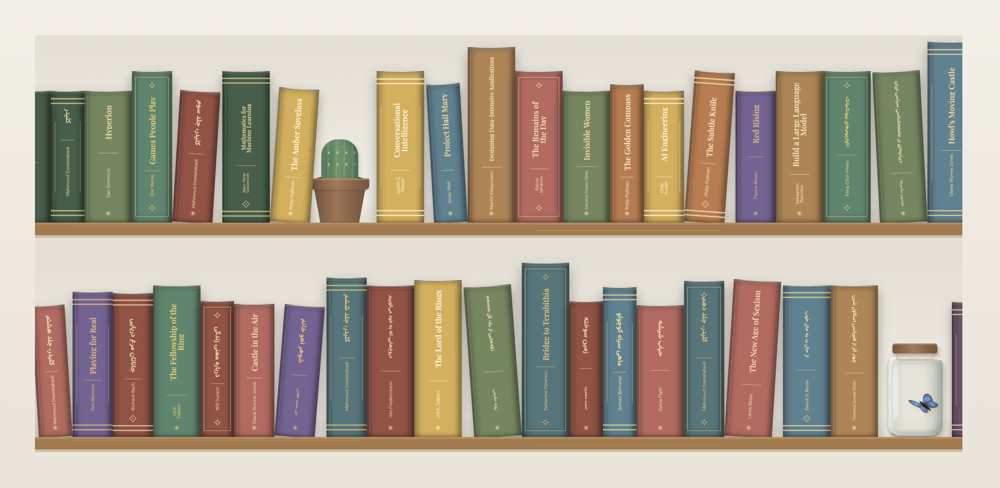

# The Tiny Library

A small bookshelf for my Goodreads books, built with JavaScript and CSS.

Supports Persian (fa) and English (en) books.



Run locally:

```sh
python3 -m http.server 8000
```

Open http://localhost:8000.

Refresh books from Goodreads:

```sh
python3 scripts/import_goodreads.py
```

Shelves use book tags:

- **read**: `read` and `did-not-finished`.
- **in progress**: `currently-reading` and `to-read`

Drag, scroll, or use the arrow keys to browse.

Click a book for an animated preview with its title, author, tags, and links. Close it with ×, Escape, or a click outside.
