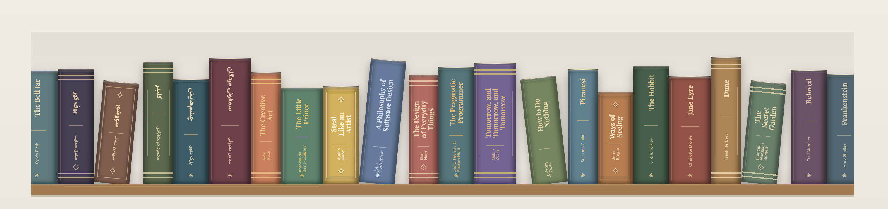

# The Tiny Library

A small, single-page bookshelf written in vanilla JavaScript and CSS.

The shelf reads its books from [`books.json`](books.json). Edit that array to add, remove, or reorder books. Each book has a title, author, spine color, accent color, and height; use `"lang": "fa"` for Persian titles. Serve the site over HTTP so the browser can fetch the JSON file.

- I will add goodreads support soon

